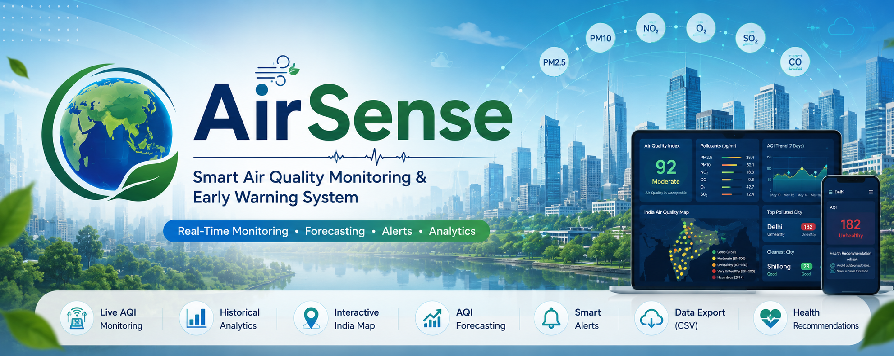
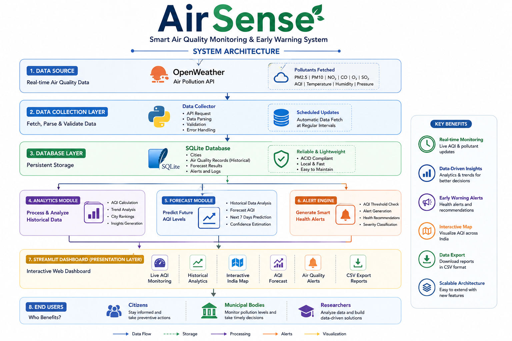
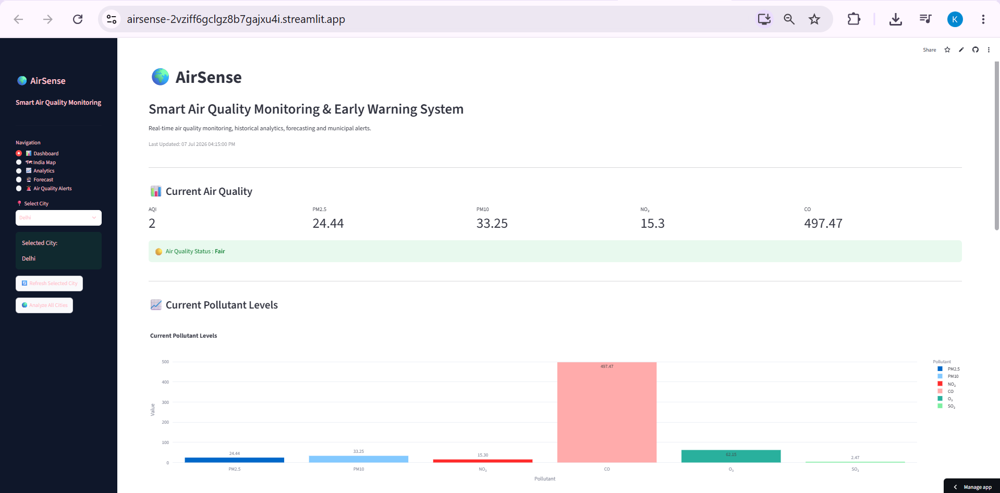
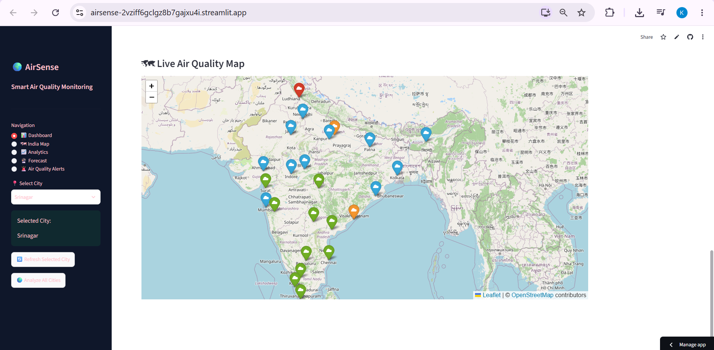
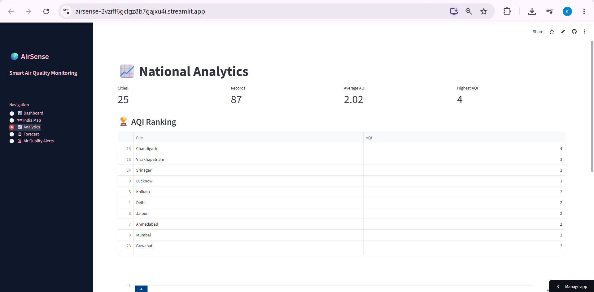
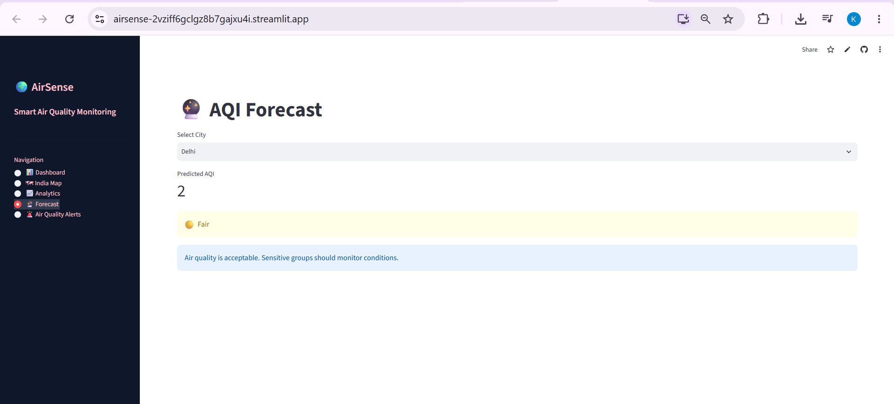
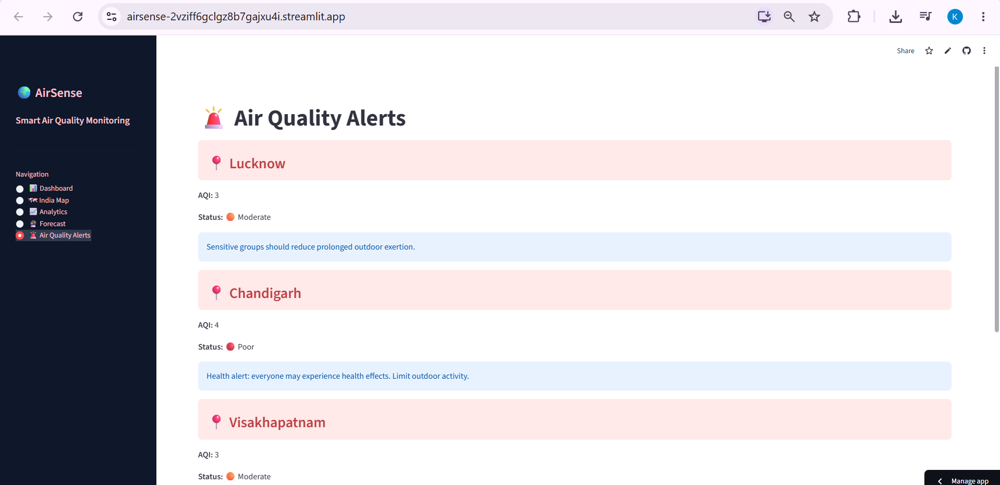

## 🌟 Repository Highlights

- 🌍 Real-Time Air Quality Monitoring
- 📈 Historical AQI Analytics
- 🗺 Interactive India Pollution Map
- 🔮 AQI Forecasting
- 🚨 Smart Health Alerts
- 📊 Comparative Analytics Dashboard
- 💾 SQLite Database Integration
- ☁ OpenWeather API Integration
- 📥 CSV Report Export
- 🎯 Built for Hackathon Demonstration
<p align="center">



</p>

<h1 align="center">🌍 AirSense</h1>

<p align="center">
Smart Air Quality Monitoring & Early Warning System
</p>

<p align="center">


</p>

<p align="center">

<a href="https://github.com/pragya2608das/AirSense">

</a>

<a href="https://github.com/pragya2608das/AirSense/fork">

</a>

<a href="https://github.com/pragya2608das/AirSense/issues">

</a>

<a href="https://github.com/pragya2608das/AirSense/blob/main/LICENSE">

</a>

</p>
---

# 🌐 Live Demo

Experience AirSense in action through the deployed web application.

> > **🚀 Live Application:** https://airsense-2vziff6gclgz8b7gajxu4i.streamlit.app
---

## 🎥 Demo Preview

The application allows users to:

- 🌍 Monitor live Air Quality Index (AQI) across major Indian cities
- 📊 Visualize pollutant concentrations using interactive charts
- 🗺 Explore city-wise AQI on an interactive India map
- 📈 Analyze historical air quality trends
- 🔮 Forecast future AQI based on historical records
- 🚨 Receive intelligent air quality alerts and health recommendations
- 📥 Export analytics reports in CSV format

---
## 🎬 Application Demo

<p align="center">
  
</p>
# 🏗️ System Architecture

AirSense follows a modular architecture that separates data collection, storage, processing, analytics, forecasting, and visualization into independent components. This design makes the system scalable, maintainable, and easy to extend with additional features such as IoT integration and advanced machine learning models.

<p align="center">
  
</p>

### Workflow

1. 🌐 Fetch live air quality data from the OpenWeather Air Pollution API.
2. 💾 Store air quality records in a SQLite database.
3. 📊 Analyze historical pollution data and generate trends.
4. 🔮 Predict future AQI values using the forecasting module.
5. 🚨 Generate health alerts based on predicted and current AQI.
6. 🌍 Display insights through an interactive Streamlit dashboard.
# ✨ Features

<table>
<tr>

<td width="33%" align="center">

## 🌍

### Live Monitoring

Real-time Air Quality Index (AQI) monitoring across major Indian cities using the OpenWeather Air Pollution API.

</td>

<td width="33%" align="center">

## 📈

### Historical Analytics

Analyze historical AQI records, pollutant trends, and city-wise comparisons using interactive visualizations.

</td>

<td width="33%" align="center">

## 🗺️

### Interactive India Map

Visualize pollution levels on an interactive India map with city markers and AQI information.

</td>

</tr>

<tr>

<td align="center">

## 🔮

### AQI Forecasting

Predict future Air Quality Index values using historical pollution data to support proactive planning.

</td>

<td align="center">

## 🚨

### Smart Alerts

Receive automated air quality alerts and health recommendations whenever pollution reaches unsafe levels.

</td>

<td align="center">

## 📥

### CSV Export

Download city-wise analytics and pollution reports in CSV format for further analysis and reporting.

</td>

</tr>
</table>

---
# 🌟 Core Functionalities

- 🌍 Monitor real-time AQI for **25+ Indian cities**
- 📊 Display PM2.5, PM10, NO₂, CO, O₃, and SO₂ levels
- 💾 Store historical pollution data in SQLite
- 📈 Visualize pollution trends using Plotly charts
- 🗺️ Interactive India Air Quality Map using Folium
- 🔮 Forecast future AQI values
- 🚨 Intelligent health alerts and recommendations
- 📊 Compare pollution levels across cities
- 📥 Export analytics reports in CSV format
- ⚡ Fast, lightweight, and responsive Streamlit dashboard

---
# 📊 Project Highlights

| Feature | Status |
|----------|--------|
| 🌍 Real-Time AQI Monitoring | ✅ |
| 📊 Historical Database | ✅ |
| 📈 Analytics Dashboard | ✅ |
| 🗺️ Interactive India Map | ✅ |
| 🔮 AQI Forecasting | ✅ |
| 🚨 Smart Alert System | ✅ |
| 📥 CSV Export | ✅ |
| 🏙️ 25+ Indian Cities | ✅ |

# 🌱 Why AirSense?

AirSense transforms live environmental data into actionable insights through an integrated platform that combines monitoring, analytics, forecasting, mapping, and intelligent alerts. Rather than simply displaying current AQI values, the system enables users to understand historical trends, compare pollution across cities, anticipate future air quality conditions, and make informed decisions based on real-time environmental information.

# 📸 AirSense Gallery

| Dashboard | India Map |
|-----------|-----------|
|  |  |

| Analytics | Forecast |
|-----------|----------|
|  |  |

| Alerts | Pollutants |
|---------|------------|
|  | 

# 🔄 Project Workflow

AirSense follows a structured pipeline to collect, process, analyze, and visualize air quality data.

```text
                User Selects a City
                         │
                         ▼
        Fetch Live AQI from OpenWeather API
                         │
                         ▼
             Validate & Process Data
                         │
                         ▼
              Store Data in SQLite Database
                         │
         ┌───────────────┼────────────────┐
         ▼               ▼                ▼
 Historical Data    AQI Forecast     Alert Engine
    Analysis         Prediction      Health Advice
         └───────────────┼────────────────┘
                         ▼
             Interactive Streamlit Dashboard
                         │
                         ▼
      Users Monitor • Analyze • Forecast • Export
```

The workflow begins when the user selects a city from the dashboard. AirSense fetches live air quality information from the OpenWeather Air Pollution API, validates and stores it in a SQLite database, and then performs historical analysis, AQI forecasting, and alert generation. Finally, all processed information is presented through an interactive Streamlit dashboard, allowing users to monitor air quality, analyze trends, and download reports.
# 📊 Data Flow

```
OpenWeather API
        │
        ▼
Fetch Live AQI
        │
        ▼
SQLite Database
        │
        ▼
Analytics Engine
        │
        ▼
Forecast Module
        │
        ▼
Alert Module
        │
        ▼
Dashboard
```
# 📦 Project Modules

### 🌍 Data Collection

- Fetches real-time air quality data using the OpenWeather Air Pollution API.
- Retrieves AQI and pollutant concentrations for monitored cities.

---

### 💾 Database Module

- Stores live AQI records in SQLite.
- Maintains historical air quality data for analysis.

---

### 📈 Analytics Module

- Generates AQI comparisons.
- Displays historical trends.
- Computes city rankings.
- Calculates summary statistics.

---

### 🔮 Forecast Module

- Predicts future AQI values using historical observations.
- Supports proactive environmental monitoring.

---

### 🚨 Alert Module

- Detects moderate, poor, and severe pollution levels.
- Generates health recommendations based on AQI.

---

### 🌍 Dashboard Module

- Displays metrics.
- Interactive charts.
- India pollution map.
- Forecast visualization.
- Alert dashboard.

# ⚡ Functional Flow

```text
Select City
      │
      ▼
Fetch AQI
      │
      ▼
Save to SQLite
      │
      ▼
Visualize Data
      │
      ▼
Generate Forecast
      │
      ▼
Generate Alerts
      │
      ▼
Display Dashboard
```
# 🏆 Hackathon Project

AirSense was developed as a hackathon project to address one of the most pressing environmental challenges—air pollution. The platform demonstrates how real-time environmental data can be transformed into meaningful insights through analytics, forecasting, and intelligent alerts. By combining live monitoring with historical analysis and visualization, AirSense enables citizens, researchers, and municipal authorities to make informed decisions and take proactive measures for healthier urban environments.

# 📈 Project Statistics

| Metric | Value |
|---------|-------|
| 🌍 Cities Monitored | 25+ |
| 📊 Pollutants Tracked | 6 |
| 💾 Database | SQLite |
| ☁ Data Source | OpenWeather Air Pollution API |
| 📈 Interactive Charts | Plotly |
| 🗺 Interactive Maps | Folium |
| 🚨 Alert System | Included |
| 🔮 Forecast Module | Included |
| 📥 CSV Export | Supported |
| 💻 Platform | Streamlit |
# 🛣️ Roadmap

### Completed

- [x] Live AQI Monitoring
- [x] Historical Data Storage
- [x] Interactive Dashboard
- [x] AQI Analytics
- [x] Interactive India Map
- [x] Forecasting Module
- [x] Smart Alert System
- [x] CSV Report Export

### Planned Improvements

- [ ] Machine Learning-based AQI Prediction (LSTM/XGBoost)
- [ ] CPCB API Integration
- [ ] IoT Sensor Integration
- [ ] User Authentication
- [ ] Mobile Application
- [ ] Weather Forecast Integration
- [ ] Email & SMS Notifications
- [ ] AI-powered Environmental Insights
- [ ] Ward-level Pollution Monitoring

# 🤝 Contributors

We welcome ideas, suggestions, and improvements.

<table>
<tr>
<td align="center">
<br>
<b>Karnean Pragya</b><br>
Project Developer
<br>
<b>Koina Deb</b><br>
Project Developer
</td>
</tr>
</table>
# 🙏 Acknowledgements

Special thanks to:

- OpenWeather for providing real-time Air Pollution API services.
- Streamlit for enabling rapid dashboard development.
- Plotly for interactive data visualization.
- Folium for map-based visualization.
- SQLite for lightweight local data storage.
- GitHub for version control and collaboration.

# ⭐ Support the Project

If you found this project useful:

- ⭐ Star this repository
- 🍴 Fork the project
- 🛠 Suggest improvements
- 🐞 Report issues
- 📢 Share the project

Your support helps improve the project and motivates future development.